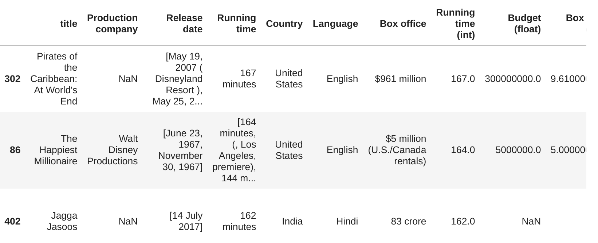

# disney data science tasks

1. [Importar librerías ](#schema1)
2. [Cargar la pagina web y convertir a un objeto BeautifulSoup](#schema2)
3. [Creamos un diccionario con las información](#schema3)
4. [Obtener cuadro de información para todas las películas](#schema4)
5. [Guardar o cargar datos](#schema5)
6. [Limpiar los datos](#schema6)
7. [Convertir los valores de  `Budget`y `Box office` a decimal](#schema7)
8. [Convertir las fechas a `datetimes`](#schema8)
9. [Añadir IMDb/Rating](#schema9)
10. [Guardar lo datos en JSON y CSV](#schema10)
11. [Documentación](#schema11)

# 1. Importar librerías
~~~python
from bs4 import BeautifulSoup as bs
import requests
~~~

# 2 Cargar la pagina web y convertir a un objeto BeautifulSoup

Primero vamos a scrapear una sola película

~~~python
url = "https://en.wikipedia.org/wiki/Toy_Story_3"
r = requests.get(url)

r
<Response [200]>
~~~

Convertir a un objeto `BeautifulSoup` y buscamos `infobox vevent` que es donde esta la información que queremos scrapear

~~~python
soup = bs(r.content)
info_box = soup.find(class_ = "infobox vevent")
info_box.get_text()
'Toy Story 3Theatrical release posterDirected byLee UnkrichProduced byDarla K. AndersonScreenplay byMichael ArndtStory by\nJohn Lasseter\nAndrew Stanton\nLee Unkrich\nStarring\nTom Hanks\nTim Allen\nJoan Cusack\nDon Rickles\nWallace Shawn\nJohn Ratzenberger\nEstelle Harris\nNed Beatty\nMichael Keaton\nJodi Benson\nJohn Morris\nMusic byRandy NewmanCinematography\nJeremy Lasky\nKim White\nEdited byKen SchretzmannProductioncompanies \nWalt Disney Pictures\nPixar Animation Studios\nDistributed byWalt Disney StudiosMotion PicturesRelease date\nJune\xa012,\xa02010\xa0(2010-06-12) (Taormina Film Fest)\nJune\xa018,\xa02010\xa0(2010-06-18) (United States)\nRunning time103 minutes[1]CountryUnited StatesLanguageEnglishBudget$200\xa0million[1]Box office$1.067\xa0billion[1]'

info_rows = info_box.find_all('tr')
~~~

# 3. Creamos un diccionario con las información

~~~python
movie_info = {}
~~~

Creamos una función llamada `get_content_value` para obtener los datos que estan contenidos en una lista `li`
~~~python

def get_content_value(row_data):
    if row_data.find("li"):
        return [li.get_text(" ", strip=True).replace("\xa0", " ") for li in row_data.find_all("li")]
    else:
        return row_data.get_text(" ", strip=True).replace("\xa0", " ")
~~~
Con este `for` iteramos por todas las filas de `info_rows` y buscamos la info

~~~python
for index, row in enumerate(info_rows):
    print(index)
    if index == 0:
        movie_info['title'] = row.find("th").get_text(" ", strip=True)
    elif index == 1:
        continue
    else:
        print(row)
        content_key = row.find("th").get_text(" ", strip=True)   
        content_value = get_content_value(row.find("td"))
        movie_info[content_key] = content_value
        
movie_info
{'title': 'Toy Story 3',
 'Directed by': 'Lee Unkrich',
 'Produced by': 'Darla K. Anderson',
 'Screenplay by': 'Michael Arndt',
 'Story by': ['John Lasseter', 'Andrew Stanton', 'Lee Unkrich'],
 'Starring': ['Tom Hanks',
  'Tim Allen',
  'Joan Cusack',
  'Don Rickles',
  'Wallace Shawn',
  'John Ratzenberger',
  'Estelle Harris',
  'Ned Beatty',
  'Michael Keaton',
  'Jodi Benson',
  'John Morris'],
 'Music by': 'Randy Newman',
 'Cinematography': ['Jeremy Lasky', 'Kim White'],
 'Edited by': 'Ken Schretzmann',
 'Production companies': ['Walt Disney Pictures', 'Pixar Animation Studios'],
 'Distributed by': 'Walt Disney Studios Motion Pictures',
 'Release date': ['June 12, 2010 ( 2010-06-12 ) ( Taormina Film Fest )',
  'June 18, 2010 ( 2010-06-18 ) (United States)'],
 'Running time': '103 minutes [1]',
 'Country': 'United States',
 'Language': 'English',
 'Budget': '$200 million [1]',
 'Box office': '$1.067 billion [1]'} 
~~~

# 4 Obtener cuadro de información para todas las películas

~~~python
r = requests.get("https://en.wikipedia.org/wiki/List_of_Walt_Disney_Pictures_films")
soup = bs(r.content)
movies = soup.select(".wikitable.sortable i a")
~~~
### Obtener la info 

Usamos la función `get_content_value` anteriomente citada.

La función `get_info_box` obtiene la información de las películas y nos devuelve una lista con ellas.

~~~python
def get_info_box(url):
    movie_info = {}
    r = requests.get(url)
    soup = bs(r.content)
    info_box = soup.find(class_="infobox vevent")
    info_rows = info_box.find_all("tr")
    
    clean_tags(soup)
    for index, row in enumerate(info_rows):
        if index == 0:
            movie_info['title'] = row.find("th").get_text(" ", strip=True)
        else:
            header = row.find('th')
            if header:
                content_key = row.find("th").get_text(" ", strip=True)
                content_value = get_content_value(row.find("td"))
                movie_info[content_key] = content_value
            
    return movie_info
~~~
Creamos un `base_path` al que le añadimos el resto del path que obtendremos, `relative_path` y vamos guardando en  `movie_info_list` todas las películas

~~~python
base_path = "https://en.wikipedia.org/"

movie_info_list = []
for index, movie in enumerate(movies):
    if index == 5:
        break
    try:
        relative_path = movie['href']
       
        full_path = base_path + relative_path
        
        #title = movie['title']
        m = get_info_box(full_path)
        
        movie_info_list.append(m)
        
    # por si nos da error alguna película    
    except Exception as e:
        print(movie.get_text())
        print(e)

movie_info_list
[{'title': 'Academy Award Review of',
  'Production company': 'Walt Disney Productions',
  'Release date': ['May 19, 1937'],
  'Running time': '41 minutes (74 minutes 1966 release)',
  'Country': 'United States',
  'Language': 'English',
  'Box office': '$45.472'},
 {'title': 'Snow White and the Seven Dwarfs',
  'Directed by': ['David Hand (supervising)',
   'William Cottrell',
   'Wilfred Jackson',
   'Larry Morey',
   'Perce Pearce',
   'Ben Sharpsteen'],
  'Produced by': 'Walt Disney',
~~~

# 5. Guardar o cargar datos

Importamos la librería json
~~~python
import json
~~~
Creamos las funciones para guardar los datos y cargarlo
~~~python

def save_data(title,data):
    with open(title, 'w', encoding='utf-8') as f:
        json.dump(data, f, ensure_ascii=False, indent=2)
def load_data(title):
    with open(title, encoding = 'utf-8') as f:
        json.load(f)
~~~

Guardamos los datos
~~~python
save_data("./data/disney_data.json", movie_info_list)
~~~

# 6. Limpiar los datos
### Creamos una función que elimine los [1] [2]..., que estan contenidos en las etiquetas `sup` y `span`
~~~python

def clean_tags(soup):
    for tag in soup.find_all(["sup", "span"]):
        tag.decompose()
~~~

### Separar las cadenas con nombres, no estaban en una `li`
Tenemos que modificar `get_content_value` para que busque también la etiqueta `br` y los separe.
~~~python
def get_content_value(row_data):
    if row_data.find("li"):
        return [li.get_text(" ", strip=True).replace("\xa0", " ") for li in row_data.find_all("li")]
    elif row_data.find('br'):
        return [text for text in row_data.stripped_strings]
    else:
        return row_data.get_text(" ", strip=True).replace("\xa0", " ")
~~~

Y guardamos el `data_cleaned.json`

### Convertir `Running time` en número
~~~python
print([movie.get('Running time', 'N/A') for movie in movie_info_list])
['41 minutes (74 minutes 1966 release)', '83 minutes', '88 minutes', '126 minutes', '74 minutes', '64 minutes', '70 minutes', '42 minutes', '65 min.', '71 minutes', '75 minutes', '94 minutes', '73 minutes', '75 minutes', '82 minutes', '68 minutes', '74 minutes', '96 minutes', '75 minutes', '84 minutes', '77 minutes', '92 minutes', '69 minutes', '81 minutes', ['60 minutes (VHS version)', '71 minutes (original)'], '127 minutes', '92 minutes', '76 minutes', '75 minutes', '73 minutes', '85 minutes', '81 minutes', '70 minutes', '90 min.', '80 minutes', '75 minutes', '83 minutes', '83 minutes', '72 minutes', '97 minutes', '75 minutes', '104 minutes', '93 minutes', '105 minutes', '95 minutes', '97 minutes', '134 minutes', '69 minutes', '92 minutes', '126 minutes', '79 minutes', '97 minutes', '128 minutes', '74 minutes', '91 minutes', '105 minutes', '98 minutes', '130 minutes', '89 min.', '93 minutes', '67 minutes', '98 minutes', '100 minutes', '118 minutes', '103 Minutes', '110 minutes', '80 min.', '79 minutes', '91 minutes', '91 minutes', '97 minutes', '118 minutes', '139 minutes', '92 minutes', 
~~~

Creamos una función que nos devuelva los valores en enteros.
Teniendo en cuenta que pueden venir solo un valor, en lista o no venir valor.
~~~python
def minutes_to_integer(running_time):
    if running_time == 'N/A':
        return None
    if isinstance(running_time, list):
        return int(running_time[0].split(' ')[0])
    else:
        return int(running_time.split(' ')[0])

for movie in movie_info_list:
    movie['Running time (int)'] = minutes_to_integer(movie.get('Running time', 'N/A'))

[41, 83, 88, 126, 74, 64, 70, 42, 65, 71, 75, 94, 73, 75, 82, 68, 74, 96, 75, 84, 77, 92, 69, 81, 60, 127, 92, 76, 75, 73, 85, 81, 70, 90, 80, 75, 83, 83, 72, 97, 75, 104, 93, 105, 95, 97, 134, 69, 92, 126, 79, 97, 128, 74, 91, 105, 98, 130, 89, 93, 67, 98, 100, 118, 103, 110, 80, 79, 91, 91, 97, 118, 139, 92, 131, 87, 116, 93, 110, 110, 131, 101, 108, 84, 78, 75, 164, 106, 110, 99, 113, 108, 112, 93, 91, 93, 100, 100, 79, 96, 113, 89, 118, 92, 88, 92, 87, 93, 93, 93, 90, 83, 96, 88, 89, 91, 93, 92, 97, 100, 100, 89, 91, 112, 115, 95, 91, 95, 104, 74, 48, 77, 104, 128, 101, 94, 104, 90, 100, 88, 93, 98, 100, 112, 84, 98, 97, 114, 96,
~~~

# 7 Convertir los valores de  `Budget`y `Box office` a decimal

Importamos las funciones de la carpeta `src`
~~~python
from src.conversion import *
~~~
La función de conversion lo que hace es a través de `regex` cambiar el formato que viene esos datos a float

~~~Python
for movie in movie_info_list:
    movie['Budget (float)'] = money_conversion(movie.get('Budget', 'N/A'))
    movie['Box office (float)'] = money_conversion(movie.get('Box office', 'N/A'))
[None, 1490000.0, 2600000.0, 2280000.0, 600000.0, 950000.0, 858000.0, None, 788000.0, None, 1350000.0, 2125000.0, None, 1500000.0, 1500000.0, None, 2900000.0, 1800000.0, 3000000.0, None, 4000000.0, 2000000.0, 300000.0, 1800000.0, None, 5000000.0, None, 4000000.0, None, None, None, None, None, None, 700000.0, None, None, None, None, None, 6000000.0, 1000000.0, None, 2000000.0, None, None, 2500000.0, None, None, 4000000.0, 3600000.0,

~~~

# 8 Convertir las fechas a `datetimes`

Creamos dos funciones, la primera para quitar si hay algún dato con parentesís.
Y la segunda convierta las fechas  datetime
~~~python
from datetime import datetime
def clean_date(date):
    return date.split('(')[0].strip()
def date_conversion(date):
    if isinstance(date, list):
        date = date[0]
    if date == 'N/A':
        return None
    date_str =clean_date(date)
    
    fmts = ["%B %d, %Y", "%d %B %Y"]
    for fmt in fmts:
        try:
            return datetime.strptime(date_str, fmt)
        except:
            pass
    return None

for movie in movie_info_list:
    movie['Release date (time)'] = date_conversion(movie.get('Release date', 'N/A'))

 'Release date (time)': datetime.datetime(1953, 2, 5, 0, 0)}
~~~

# 9 Añadir IMDb/Rating

Importamos las librerías necesarias. 
Tenemos que trabajar con keys asi que cuidado con poner las cles visibles.

~~~python
import os
from dotenv import load_dotenv
load_dotenv()
apikey=os.environ.get('TOKEN')

import urllib3
from urllib.parse import urlencode

import requests
~~~

Creamos la funciones para obtener el rating de imbd
~~~python
def get_omdb_info(title):
    base_url = "http://www.omdbapi.com/?"
    parameters = {"apikey" :apikey,
              't':title
             }
    params_encoded = urlencode(parameters)
    full_url = base_url + params_encoded
    return requests.get(full_url).json()

for movie in movie_info_list:
    title = movie['title']
    omdb_info = get_omdb_info(title)
    movie['imdb'] = omdb_info.get('imdbRating', None)

'imdb': '6.3'}
~~~

# 10. Guardar lo datos en JSON y CSV

Hacemos una copia de las lista con las películas
~~~python
movie_info_copy = [movie.copy() for movie in movie_info_list]
~~~
Cambiamos el formato de `datetime`
~~~python
for movie in movie_info_copy:
    current_date = movie['Release date (datetime)']
    if current_date:
        movie['Release date (datetime)'] = current_date.strftime("%B %d, %Y")
    else:
        movie['Release date (datetime)'] = None
'April 20, 1946'
~~~
Guardamos como json
~~~python
save_data("disney_data_final.json", movie_info_copy)
~~~
Para guardar como csv, cremos un dateframe y es lo guardamos como csv

~~~python
import pandas as pd

df = pd.DataFrame(movie_info_copy)
df.to_csv("./data/disney_movie_data_final.csv")
running_times = df.sort_values(['Running time (int)'],  ascending=False)
running_times.head(20)
~~~

# 11. Documentación
https://www.youtube.com/watch?v=Ewgy-G9cmbg&t=93s

https://github.com/KeithGalli/disney-data-science-tasks

https://en.wikipedia.org/wiki/List_of_Walt_Disney_Pictures_films

https://urllib3.readthedocs.io/en/latest/user-guide.html?highlight=urlencode#query-parameters

http://www.omdbapi.com/